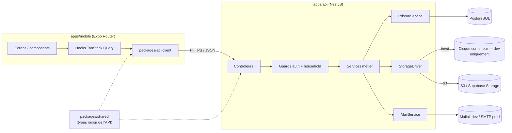
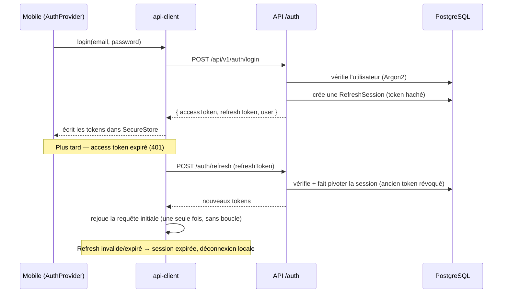
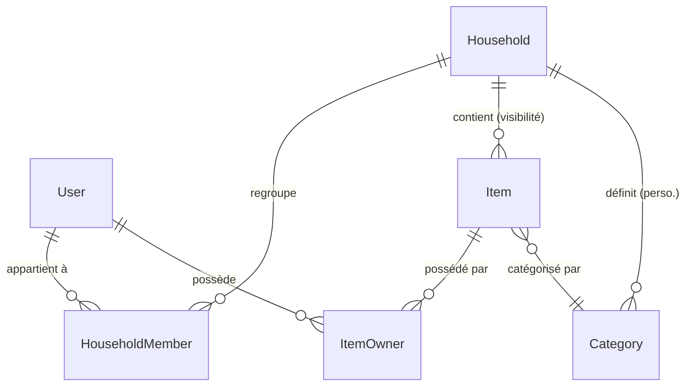
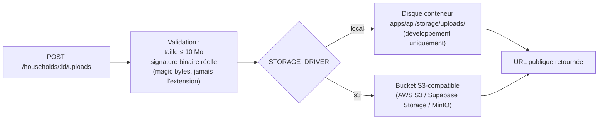

# Architecture — Notre Nid

Vue d'ensemble technique du dépôt, conforme à `docs/NOTRE_NID_PRD.md` (sections 1, 3, 5, 6, 10) et à `CLAUDE.md`. Complète `docs/API.md` (contrat détaillé) et `docs/DECISIONS.md` (justification des choix).

## Vue globale

Le mobile **n'appelle jamais l'API directement depuis un composant** : tout passe par `packages/api-client`, qui centralise l'URL de l'API, l'attache du token, le rafraîchissement automatique et le mapping des erreurs. La logique métier (règles d'autorisation, invariants du modèle de données) vit exclusivement dans les services NestJS, jamais dans les contrôleurs ni dans les composants visuels du mobile (voir `CLAUDE.md`).

## Frontières des modules

| Module | Rôle | Ne fait jamais |
| --- | --- | --- |
| `apps/api/src/<domaine>` (`auth`, `households`, `items`, ...) | Logique métier, un module NestJS par domaine | Accéder à Prisma depuis un autre domaine sans passer par son propre service |
| `apps/api/src/common` | Guards, filtre d'erreurs, décorateurs Swagger, logger, middleware `requestId` | Contenir de la logique métier spécifique à un domaine |
| `packages/shared` | Types de domaine, constantes (miroir exact des réponses API) | Dépendre de React Native ni de NestJS |
| `packages/api-client` | Client HTTP typé, gestion des tokens et du rafraîchissement | Contenir du JSX ou une dépendance à Expo |
| `apps/mobile/src/screens` + `app/` | Écrans, navigation Expo Router | Appeler `fetch`/`axios` directement — toujours via un hook `packages/api-client` |
| `apps/mobile/src/components` | Design system pur (aucune logique réseau) | Connaître l'existence de l'API |

## Flux d'authentification

- Access token JWT courte durée (`JWT_ACCESS_TTL`), jamais stocké côté serveur.
- Refresh token opaque, haché en HMAC-SHA256 avant stockage (`RefreshSession.tokenHash`), rotatif (chaque `refresh` révoque l'ancien et en émet un nouveau) et révocable individuellement (`logout`) ou globalement (`logout-all`).
- Le mobile ne stocke jamais de token en clair ailleurs que dans Expo SecureStore.
- `packages/api-client` déduplique les rafraîchissements concurrents (single-flight) pour éviter une tempête de requêtes `/auth/refresh` si plusieurs appels échouent en même temps.

## Modèle household / propriétaires d'items

`Household` détermine **qui peut voir et modifier** un item ; `ItemOwner` (relation plusieurs-à-plusieurs explicite, jamais un simple `ownerId`) détermine **à qui l'objet appartient réellement**. Un item du household « Notre nid » peut donc appartenir à un seul membre, à l'autre, ou aux deux — voir `docs/NOTRE_NID_PRD.md` section 1. Chaque propriétaire ajouté est vérifié comme membre du même household que l'item (`ItemsService`).

**Isolation stricte** : chaque route sous `/households/:householdId/...` est protégée par `HouseholdMembershipGuard`, qui vérifie en base que l'utilisateur authentifié est bien membre de ce household avant tout accès — jamais de confiance dans le `householdId` reçu du client. Un item d'un household étranger renvoie `404 NOT_FOUND`, jamais une fuite d'information distinguant « n'existe pas » de « accès refusé ».

## Gestion des images

Le driver actif est sélectionné à l'exécution par `STORAGE_DRIVER` (`apps/api/src/uploads/uploads.module.ts`), derrière l'interface commune `StorageDriver` (`apps/api/src/uploads/storage/storage-driver.interface.ts`). Le nom de fichier stocké est toujours un UUID généré côté serveur (jamais le nom fourni par le client), et `UploadsService.remove` revalide ce format avant toute suppression, indépendamment du driver actif. Voir `docs/DEPLOYMENT.md` pour la configuration du bucket en production.

## Dépendances externes

| Service | Développement | Production |
| --- | --- | --- |
| Base de données | PostgreSQL 16 (Docker Compose) | PostgreSQL managé (Neon/Supabase/Railway...) — voir `docs/DEPLOYMENT.md` |
| Stockage d'images | Disque local (`STORAGE_DRIVER=local`) | S3-compatible / Supabase Storage (`STORAGE_DRIVER=s3`) |
| Emails | Mailpit (capture SMTP locale) | SMTP réel (`SMTP_*`) |
| Observabilité | Logs lisibles console | Logs JSON + `SENTRY_DSN` optionnel |

## Documents liés

- [docs/API.md](API.md) — contrat REST détaillé.
- [docs/DECISIONS.md](DECISIONS.md) — pourquoi ces choix (PostgreSQL, NestJS, REST, `ItemOwner`, suppression logique, pas de microservices).
- [docs/DEPLOYMENT.md](DEPLOYMENT.md) — stratégies de mise en production.
- [docs/OPERATIONS.md](OPERATIONS.md) — opérations courantes une fois en production.
