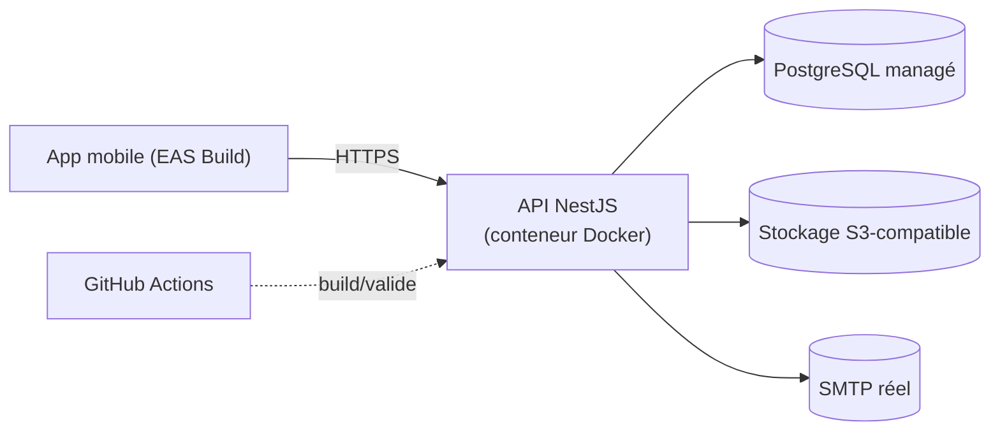

# Déploiement — Notre Nid

Ce document décrit **comment** déployer l'API et le stockage en production. Les opérations elles-mêmes (créer un compte, payer un service, exécuter une migration contre une vraie base) restent des actions manuelles du propriétaire du dépôt — voir `docs/GO_LIVE_CHECKLIST.md` pour la checklist pas à pas. Aucune de ces opérations n'a été exécutée par Claude Code (voir `CLAUDE.md`, section « opérations destructives »).

## Vue d'ensemble



L'API est **stateless** (aucune session en mémoire, refresh tokens en base) : plusieurs instances peuvent tourner derrière un load balancer sans configuration supplémentaire, à condition que **les migrations ne soient jamais lancées automatiquement au démarrage** (voir « Migrations » ci-dessous).

## Stratégie 1 (recommandée) — hébergeurs managés

Adaptée à ce projet : coût faible, pas de serveur à administrer, sauvegardes gérées par le fournisseur.

| Composant | Options recommandées | Notes |
| --- | --- | --- |
| API | Railway, Render ou Fly.io | Déploiement à partir de l'image Docker (`infrastructure/docker/api/Dockerfile`, cible `runtime`) ou du buildpack natif du service. |
| PostgreSQL | Neon, Supabase ou l'addon PostgreSQL de Railway | Préférer une base managée à un PostgreSQL auto-hébergé pour un petit projet personnel nécessitant de la fiabilité (sauvegardes automatiques, haute disponibilité gérées par le fournisseur). |
| Stockage images | Supabase Storage ou AWS S3 | `STORAGE_DRIVER=s3` (voir `apps/api/src/uploads/storage/s3-storage.driver.ts`) — fonctionne avec tout stockage compatible S3. |
| Mobile | EAS Build (Expo) | Voir `docs/MOBILE_RELEASE.md`. |

### Étapes (résumé — détail avec valeurs exactes dans `docs/GO_LIVE_CHECKLIST.md`)

1. Créer la base PostgreSQL managée → obtenir `DATABASE_URL`.
2. Créer le bucket de stockage (Supabase Storage ou S3) → obtenir `STORAGE_BUCKET`, `STORAGE_ENDPOINT` (si non-AWS), `STORAGE_REGION`, `STORAGE_ACCESS_KEY`, `STORAGE_SECRET_KEY`. **Configurer le bucket en lecture publique** pour les couvertures d'items (l'API génère des URLs publiques directes, pas d'URL signée — voir `docs/DECISIONS.md`).
3. Générer des secrets JWT dédiés à la production (`openssl rand -hex 32`, deux valeurs distinctes pour `JWT_ACCESS_SECRET` et `JWT_REFRESH_SECRET`) — **jamais** réutiliser les valeurs de développement ou de CI.
4. Configurer un service SMTP réel (ex. Resend, Postmark, SMTP du fournisseur d'hébergement) → `SMTP_HOST`/`SMTP_PORT`/`SMTP_USER`/`SMTP_PASSWORD`/`SMTP_FROM`. Mailpit ne doit **jamais** être utilisé en production.
5. Créer le service d'hébergement de l'API, y renseigner toutes les variables de `.env.example` (voir tableau ci-dessous), pointer sur `infrastructure/docker/api/Dockerfile` (cible `runtime`) ou configurer le buildpack Node du fournisseur avec `pnpm --filter @notre-nid/api run build` puis `pnpm --filter @notre-nid/api run start:prod`.
6. Exécuter les migrations de production (voir section dédiée) **avant** de basculer le trafic vers la nouvelle version.
7. Vérifier `GET https://<url-api>/api/v1/health` et `/health/ready`.
8. Renseigner `MOBILE_PUBLIC_API_URL` / `EXPO_PUBLIC_API_URL` avec l'URL publique de l'API pour les builds mobiles (voir `docs/MOBILE_RELEASE.md`).

## Stratégie 2 — VPS + Docker Compose

Plus de contrôle, plus de responsabilité opérationnelle (mises à jour de sécurité du système, monitoring, sauvegardes manuelles). À réserver à un profil à l'aise avec l'administration Linux.

- VPS (ex. Hetzner, OVH, DigitalOcean) avec Docker + Docker Compose installés.
- Reverse proxy avec HTTPS automatique (Caddy ou Traefik recommandés — renouvellement Let's Encrypt sans intervention manuelle ; nginx + certbot en alternative plus manuelle).
- PostgreSQL : **préférer une base managée** même dans cette stratégie (voir mise en garde ci-dessous) ; à défaut, conteneur PostgreSQL avec volume Docker persistant et sauvegardes `pg_dump` planifiées (`infrastructure/scripts/backup-postgres.sh`, voir `docs/BACKUP_AND_RESTORE.md`).
- Image API construite via `infrastructure/docker/api/Dockerfile` (cible `runtime`), lancée par un `docker-compose.prod.yml` propre à l'infrastructure du VPS (non fourni ici : sa forme dépend du reverse proxy choisi — voir le squelette ci-dessous).

```yaml
# Squelette indicatif — à adapter au reverse proxy et aux volumes réels du VPS.
services:
  api:
    image: notre-nid-api:latest
    restart: unless-stopped
    env_file: .env.production # jamais commité, permissions 600
    expose:
      - '3000'
  reverse-proxy:
    image: caddy:2-alpine
    restart: unless-stopped
    ports: ['80:80', '443:443']
    volumes:
      - ./Caddyfile:/etc/caddy/Caddyfile
      - caddy_data:/data
volumes:
  caddy_data:
```

> **Mise en garde** (section 21 du PRD) : une base de données managée est généralement préférable à PostgreSQL auto-hébergé pour un petit projet personnel nécessitant de la fiabilité — sauvegardes, mises à jour de sécurité et haute disponibilité sont gérées par le fournisseur plutôt que par le propriétaire du VPS.

## Migrations de production

**Ne jamais** lancer `prisma migrate dev` contre une base de production (mode interactif, pensé pour le développement). Utiliser exclusivement :

```bash
pnpm --filter @notre-nid/api run db:migrate:deploy   # = prisma migrate deploy
```

- Exécuter cette commande **une seule fois**, depuis un environnement disposant de `DATABASE_URL` pointant vers la base de production (poste de déploiement, job CI dédié, ou cible `migrate` de l'image Docker : `docker run --rm -e DATABASE_URL=... notre-nid-api:migrate`) — **jamais** automatiquement au démarrage de chaque instance de l'API (plusieurs instances migreraient simultanément).
- Toujours **avant** de basculer le trafic vers la nouvelle version de l'API.
- Toujours précédé d'une sauvegarde récente (`docs/BACKUP_AND_RESTORE.md`) avant une migration jugée risquée (renommage/suppression de colonne, changement de type).
- Le schéma applique une nouvelle migration à chaque évolution — jamais de modification d'une migration déjà appliquée (`apps/api/prisma/migrations/`), conformément à `CLAUDE.md`.

## Variables d'environnement de production

Voir [.env.example](../.env.example) pour la liste complète et commentée. Points spécifiques à la production :

| Variable | Attention en production |
| --- | --- |
| `NODE_ENV` | `production` — désactive Swagger (`/api/v1/docs`), active les logs JSON. |
| `JWT_ACCESS_SECRET` / `JWT_REFRESH_SECRET` | Générer des valeurs dédiées (`openssl rand -hex 32`), jamais celles de développement ou de CI. |
| `CORS_ORIGINS` | Restreindre strictement (l'app mobile n'envoie pas d'origine `Origin` de navigateur — cette liste protège une éventuelle future app web, voir `docs/ROADMAP.md`). |
| `API_PUBLIC_URL` | URL HTTPS publique réelle de l'API (utilisée pour construire les URLs d'images en `STORAGE_DRIVER=local` — à éviter en production, voir ci-dessous). |
| `STORAGE_DRIVER` | `s3` en production — `local` perd toutes les images au moindre redéploiement (filesystem de conteneur éphémère). |
| `SMTP_*` | Service SMTP réel, jamais Mailpit. |
| `SENTRY_DSN` | Optionnel — voir `docs/OPERATIONS.md` pour la configuration du monitoring. |

## HTTPS et CORS

- HTTPS est **terminé par la plateforme d'hébergement** (Railway/Render/Fly) ou par le reverse proxy (stratégie VPS) — l'API NestJS elle-même écoute en HTTP simple derrière ce point de terminaison, comme en développement.
- `helmet()` est déjà actif (`apps/api/src/main.ts`) et reste inchangé en production.
- `CORS_ORIGINS` doit lister explicitement les origines autorisées (séparées par des virgules) ; une app mobile Expo native n'envoie pas d'en-tête `Origin`, donc cette restriction protège principalement une future application web (voir `docs/ROADMAP.md`), pas le mobile lui-même.

## Documents liés

- [docs/BACKUP_AND_RESTORE.md](BACKUP_AND_RESTORE.md) — sauvegardes et restauration.
- [docs/OPERATIONS.md](OPERATIONS.md) — opérations courantes une fois en ligne.
- [docs/MOBILE_RELEASE.md](MOBILE_RELEASE.md) — génération et distribution de l'application mobile.
- [docs/GO_LIVE_CHECKLIST.md](GO_LIVE_CHECKLIST.md) — checklist complète, avec valeurs et commandes exactes.
